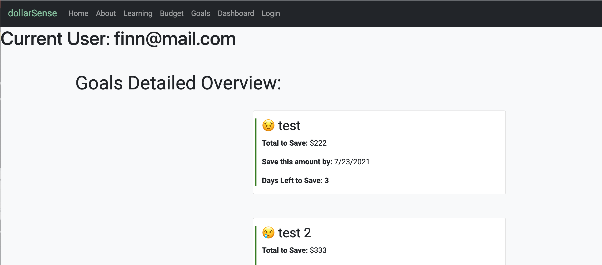
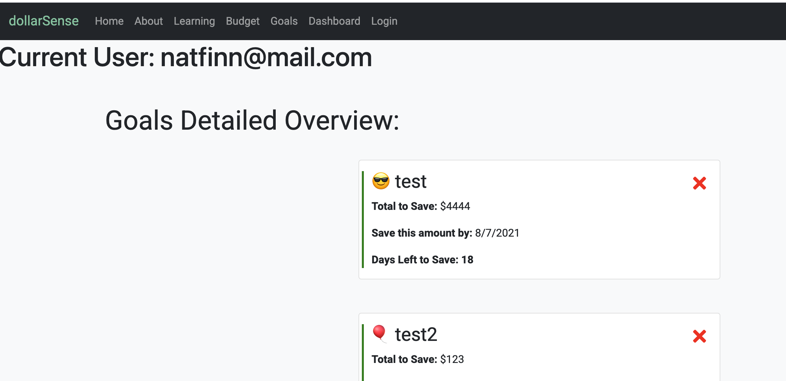
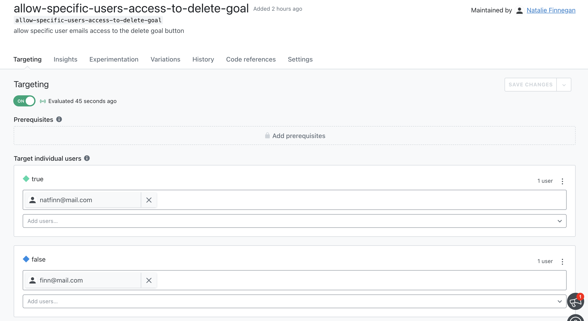

[](#license)


# dollarSense

This was forked from a group project I worked on in order to implement a LaunchDarkly Feature Flag

## Feature Flag Created

The feature flag I implemented was to allow a specific user access to a delete button, while hiding it from another specified user

- User with access to delete: `natfinn@mail.com`
- User without access to delete: `finn@mail.com`
- Password for both users is: `bubbles`

### Installation Instructions

- Clone the repo to your local machine and do an `npm i` in your folder's terminal
- Once the install is complete please enter `npm start` to get the application running
- The application will open on `http://localhost:3000/` and bring you to a landing page prompting sign up or login
- Sign in as each individual user (information above) and navigate to the `Goals` page in the Navbar to test each user's access
  - the delete icon will be an `x` in the top right corner of each goal card depending on the user you are logged in as (screen shots below)
- The SDK key does NOT need to be updated because it is generated dynamically through firebase auth & coincides with the user logged in
- Once you are logged in as a specific user, you must navigate to `Dashboard` in the Navbar to log out and re-sign in as the other user (by navigating to `Home` or `Login` in the Navbar)
- To view the implemented code please navigate to `dollar-sense/client/src/komponent/Goal/Goal.js`, preview below

  ```md
      useEffect(() => {
          var user = {
          "key": `${auth.currentUser.email}`
           };
          const ldclient = LDClient.initialize('60f750d5b1a03d26078523a7', user);

      ldclient.on('ready', function() {

          var showFeature = ldclient.variation("allow-specific-users-access-to-delete-goal");
          setFeatureFlag(showFeature)
          console.log("It's now safe to request feature flags", showFeature);
              if (showFeature) {
               console.log("showing feature")
          } else {
              console.log("not showing feature")
           }

  })
  }, [])
  ```

- Feature flag conditional
  ```md
        {featureFlag && <FaTimes
                className="deleteIcon"
                style={{ color: "red", cursor: "pointer" }}
                onClick={() => onDelete(id)}
              /> }
  ```

## Preview of User's View

- `finn@mail.com` client view:



- `natfinn@mail.com` client view:



- Feature Flag on LaunchDarkly platform


